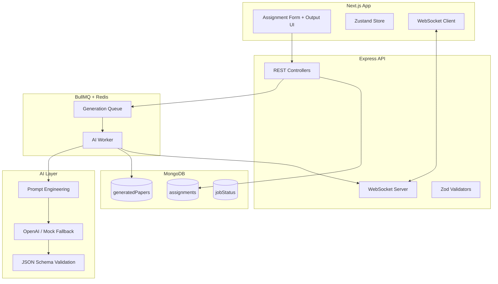

# VedaAI — AI Assessment Creator Platform

Production-quality AI Assessment Generator for teachers. Create assignments, generate structured question papers via AI, receive real-time updates over WebSockets, and export professional PDFs.

Based on the [VedaAI Figma design](https://www.figma.com/design/nB2HMm1BhTpmHcHrmEslGB/VedaAI---Hiring-Assignment).

## Architecture



## Tech Stack

| Layer | Technologies |
|-------|-------------|
| Frontend | Next.js 16 (App Router), TypeScript, Tailwind CSS v4, Zustand, react-hot-toast |
| Backend | Node.js, Express, TypeScript, MongoDB, Redis, BullMQ, WebSocket (`ws`) |
| AI | OpenAI GPT-4o-mini (JSON mode), Zod validation, mock fallback |
| PDF | PDFKit (server-side export) |

## Project Structure

```
vedAi/
├── frontend/
│   ├── src/app/              # Pages (dashboard, create, output)
│   ├── src/components/       # UI + layout
│   ├── src/features/         # Assignment form, paper view
│   ├── src/store/            # Zustand
│   ├── src/services/         # API client
│   └── src/hooks/            # WebSocket hook
├── backend/
│   └── src/
│       ├── modules/          # Mongoose models
│       ├── controllers/      # REST handlers
│       ├── services/         # AI, PDF, prompts
│       ├── workers/          # BullMQ consumer
│       ├── queues/           # Job queue
│       ├── websocket/        # Real-time events
│       └── validators/       # Zod schemas
├── docker-compose.yml
└── README.md
```

## Quick Start

### Prerequisites

- Node.js 20+
- Docker (for MongoDB + Redis)

### 1. Start infrastructure

```bash
docker compose up -d
```

### 2. Backend

```bash
cd backend
cp .env.example .env
# Set OPENAI_API_KEY or GROK_API_KEY (see Grok section below)
npm install
npm run dev
```

### Using Groq (recommended for `gsk_` keys)

If your key starts with **`gsk_`**, it is a **Groq** key (not xAI Grok):

```env
LLM_PROVIDER=groq
GROQ_API_KEY=gsk-your-key
GROQ_MODEL=llama-3.3-70b-versatile
MOCK_AI=false
```

Provider is auto-detected from the key prefix if `LLM_PROVIDER` is omitted.

**Run tests:**

```bash
cd backend
npm run test:llm    # smoke + full paper generation
npm run test:e2e    # API + queue + PDF (server must be running)
```

### Using Grok (xAI)

1. Create an API key at [console.x.ai](https://console.x.ai)
2. Add to `backend/.env`:

```env
LLM_PROVIDER=grok
GROK_API_KEY=xai-your-key-here
XAI_MODEL=grok-4-1-fast-non-reasoning
MOCK_AI=false
```

3. Restart the backend and verify: `curl http://localhost:4000/health` → `"llmProvider":"grok"`, `"mockAi":false`

### 3. Frontend

```bash
cd frontend
cp .env.local.example .env.local
npm install
npm run dev
```

Open [http://localhost:3000](http://localhost:3000).

### Run both (from root)

```bash
npm install
npm run docker:up
npm run dev
```

## Environment Variables

### Backend (`backend/.env`)

| Variable | Description | Default |
|----------|-------------|---------|
| `PORT` | API port | `4000` |
| `MONGODB_URI` | MongoDB connection | `mongodb://localhost:27017/vedaai` |
| `REDIS_URL` | Redis for BullMQ + cache | `redis://localhost:6379` |
| `LLM_PROVIDER` | `openai` or `grok` | `openai` |
| `OPENAI_API_KEY` | OpenAI API key | — |
| `OPENAI_MODEL` | OpenAI model | `gpt-4o-mini` |
| `GROK_API_KEY` / `XAI_API_KEY` | xAI Grok API key ([console.x.ai](https://console.x.ai)) | — |
| `XAI_MODEL` / `GROK_MODEL` | Grok model | `grok-4-1-fast-non-reasoning` |
| `CORS_ORIGIN` | Allowed frontend origin | `http://localhost:3000` |
| `QUEUE_CONCURRENCY` | Worker concurrency | `2` |
| `MOCK_AI` | Force mock generation | `false` |

### Frontend (`frontend/.env.local`)

| Variable | Description |
|----------|-------------|
| `NEXT_PUBLIC_API_URL` | Backend REST URL |
| `NEXT_PUBLIC_WS_URL` | WebSocket URL |

## API Endpoints

| Method | Path | Description |
|--------|------|-------------|
| `GET` | `/health` | Health check |
| `GET` | `/api/assignments` | List assignments |
| `POST` | `/api/assignments` | Create + queue generation |
| `GET` | `/api/assignments/:id` | Assignment + paper + status |
| `GET` | `/api/assignments/:id/status` | Job progress |
| `GET` | `/api/assignments/:id/pdf` | Download PDF |
| `POST` | `/api/assignments/:id/regenerate` | Full or section regenerate |

## WebSocket Events

Connect: `ws://localhost:4000/ws?assignmentId=<id>`

| Event | Description |
|-------|-------------|
| `generation_started` | Job picked up |
| `generation_progress` | Progress % + state |
| `generation_completed` | Paper ready |
| `generation_failed` | Error message |

## AI Pipeline

1. Form input → sanitized payload → MongoDB
2. BullMQ job enqueued
3. Worker builds curriculum-aware prompt (Bloom's taxonomy, difficulty %)
4. OpenAI returns JSON → Zod `questionPaperSchema` validation
5. Duplicate detection + difficulty balancing
6. Redis cache for identical prompts
7. Structured paper stored — **never raw LLM text in UI**

### Question Paper Schema

```typescript
type QuestionPaper = {
  title: string;
  subject: string;
  totalMarks: number;
  duration: string;
  sections: {
    title: string;
    instruction: string;
    questions: {
      question: string;
      difficulty: "easy" | "medium" | "hard";
      marks: number;
    }[];
  }[];
};
```

## Security

- Helmet, CORS, rate limiting (100 req / 15 min)
- Input sanitization (sanitize-html)
- File type + size validation (multer)
- Zod API validation
- Env-based secrets

## Deployment

1. Deploy MongoDB Atlas + Redis (Upstash/ElastiCache)
2. Set production env vars on backend
3. Build frontend: `npm run build` → deploy to Vercel
4. Deploy backend to Railway/Render/Fly.io with WebSocket support
5. Point `NEXT_PUBLIC_API_URL` and `NEXT_PUBLIC_WS_URL` to production

## Customization

| Variable | Options |
|----------|---------|
| LLM | OpenAI or **Grok (xAI)** via `LLM_PROVIDER=grok` |
| PDF | PDFKit (current) or Puppeteer for HTML→PDF |
| State | Zustand (current) or Redux Toolkit |
| Queue concurrency | `QUEUE_CONCURRENCY` env |

## License

MIT — Built for VedaAI hiring assignment evaluation.
